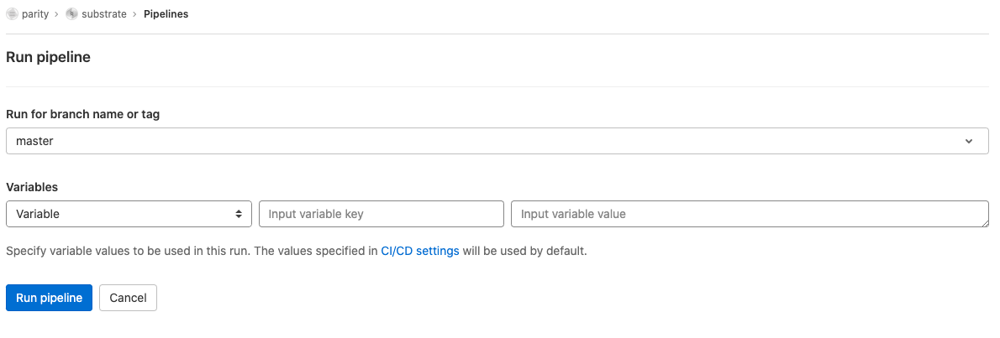

# Substrate Rustdoc Release Process

Substrate rustdoc sits on the [paritytech/substrate `gh-pages` branch](https://github.com/paritytech/substrate/tree/gh-pages) and is accessible at https://paritytech.github.io/substrate.

If you inspect the `gh-pages` branch, it is just various different version of rustdocs located in different folders, with folder name marking the monthly tag version, or a release tag version.

The actual rustdoc generation process takes place as part of the project [GitLab pipeline](https://gitlab.parity.io/parity/substrate/-/pipelines).

## Add a new version of rustdoc

To add a new version of rustdocs, you need to manually trigger a build job in the
[GitLab pipeline](https://gitlab.parity.io/parity/substrate/-/pipelines/new).

In the pipeline screen, pick:

- Run for branch name or tag: `master`

- Add the following variables:
  - `BUILD_RUSTDOC_REF`: `<git branch name | tag name>` (required)
    This parameter specifies which branch or tag of the rustdoc to be built.
    The built rustdoc will be accessible at: https://paritytech.github.io/substrate/<branch | tag>.

  - `LATEST`: `<git branch name | tag name>` (optional)
    This parameter specifies which branch or tag of the rustdoc is to be aliased with `latest`.
    This will cause that version of rustdoc be accessible at:
    https://paritytech.github.io/substrate/latest. Currently, it is set to [`monthly-2021-10`](../.gitlab-ci.yml#L56).

  - `RESET_INDEX`: "true" (optional)
    This parameter specifies if you want to reset the currently deployed `index.html`. When you set
    this parameter to `true`, please also specified the `LATEST` parameter so the index page shows
    which branch is `latest` shortcut pointing to.

- Wait for the whole pipeline to complete. This may take 30 - 60 mins.

It is fine to rebuild the rustdocs of the same branch / tag again. The existing rust doc will just
be overwritten.

## Remove an existing version of rustdoc

To remove an existing version of rustdocs, you need to manually trigger a build job in the
[GitLab pipeline](https://gitlab.parity.io/parity/substrate/-/pipelines/new).

In the pipeline screen, pick:

- Run for branch name or tag: `master`

- Add the following variables:
  - `RM_RUSTDOC_REF`: `<git branch name | tag name>` (required)
    This parameter specifies the version of rustdoc to be removed.

- Wait for the whole pipeline to complete. This take 10 - 20 mins.

## Config branch/tag for rebuilding rustdoc when there is new commit

In the [`.gitlab-ci.yml`](../.gitlab-ci.yml), there is [`CONT_RUSTDOC_BUILT_REFS` variable](../.gitlab-ci.yml#L52). Tags branches specified in this var will be rebuilt everytime when new
commits are pushed. Currently it is set to `master` only. It supports multiple value by separating
with a space, e.g. `master development`.
